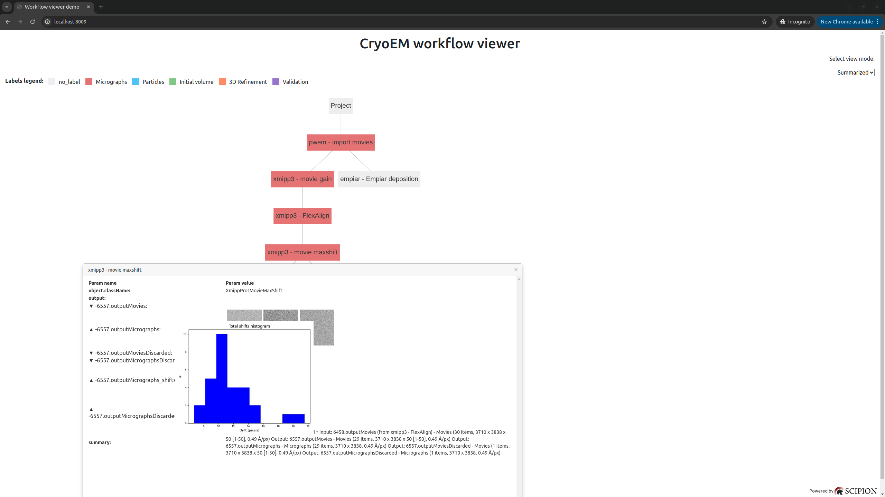

# web-workflow-viewer

HTML Workflow viewer for workflow json files exported from Scipion. Developed as a web component - see demo in [index.html](https://github.com/I2PC/web-workflow-viewer/blob/master/index.html). 

To use the web component we need to:

1. Link to webcomponents-loader.js to manage polyfills for browser support. More about polyfills [here](https://github.com/webcomponents/webcomponentsjs)
```
<script src="js/webcomponents/webcomponents-loader.js"></script>
```
2. Link to the component itself:
```
<link rel="import" href="scipion-workflow.html">
```
3. Place the viewer wherever it suits best, linking its json file:
```
<scipion-workflow src="workflow.json" height="600px" width="600px"></scipion-workflow>
```

To view the demo, get inside this repo's dir and serve index.html via http:
```
$ cd web-workflow-viewer
$ python -m SimpleHTTPServer 8009
```
Open file on http://localhost:8009 on your browser, you should see something like this:


Learn more about web components [here](https://www.polymer-project.org/2.0/start/quick-tour) and [here](https://developer.mozilla.org/en-US/docs/Web/Web_Components/Custom_Elements).
